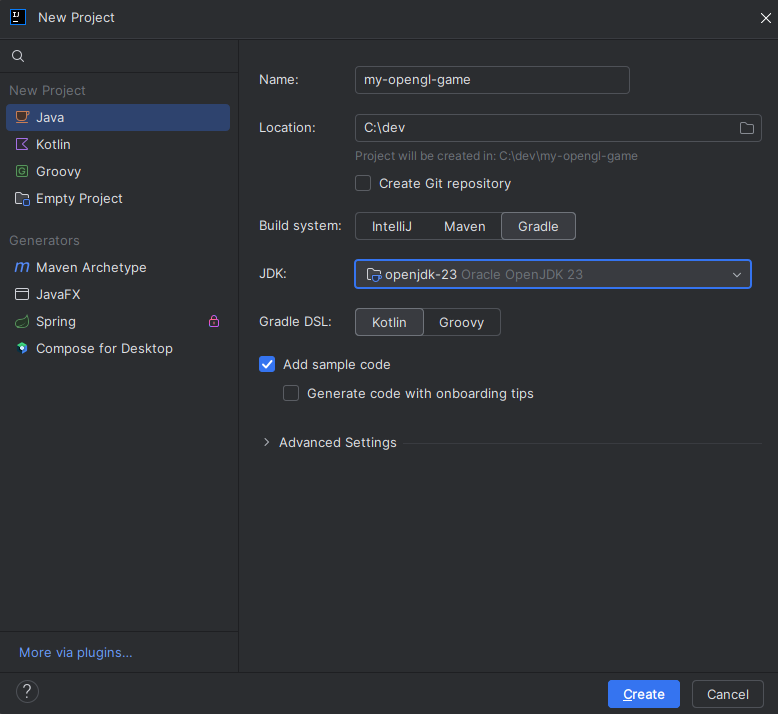

## Programming Environment

Most of you will probably already be familiar with creating a new Java project.
But for the sake of getting everyone on the same page I'll briefly get into how to set things up.
For the development I will be using JetBrains Intelli IDEA Community Edition.
If you've had some experience programming in Java, chances are you're already somewhat familiar with either Intellij or Eclipse.
An IDE can make project management easier.
Build tools and version control are usually neatly integrated with the IDE,
and you can execute buildscripts and git commands from a UI instead of using a terminal.

*I won't spend much time on installation, as I suspect most of you have some form of a setup already.*

### Installation

*These are the installation steps for Windows 11.
Some of the steps are different depending on your platform, but you can easily find resources online.*

#### JDK (Java Development Kit)

1. Go to the [Oracle](https://www.oracle.com/java/technologies/downloads/) download page for the latest version
2. Download the "x64 Installer" (Windows)
3. Run the installer executable and select an appropriate directory. Make sure to remember the path for later (default path is fine)

#### Intellij IDEA

1. Install [Intellij IDE](https://www.jetbrains.com/idea/download/?section=windows)
2. In IntelliJ select: new -> project...
3. If you find the installed JDK in the JDK drop-down (either selected or detected), you're done
4. If not, click "Add JDK from disk" and provide the installation path from earlier
5. From now on Intellij should be aware of the installed JDK

#### Without an IDE

If you prefer working in an editor like emacs or vim, you'll need to install Gradle on your machine and set up environment variables (Windows) for both Java and Gradle.

* When installing [Gradle](https://gradle.org/install/) manually. Make sure the Gradle version is compatible with the JDK

## Creating a Gradle Project

After installing Intellij and the JDK we're ready to create a new project.
Selecting Gradle as our build system and Kotlin for Gradle DSL (Build script language).



After creating a new gradle project, the project structure will look something like this:

```
Project/
├─ .gradle/
├─ .idea/
├─ gradle/
├─ src/
│  ├─ main/
│  ├─ test/
├─ .gitignore
├─ build.gradle.kts
├─ gradlew
├─ gradle.bat
├─ settings.gradle.kts
```

With the following script int the build.gradle.kts file:

```
plugins {
    id("java")
}

group = "org.example"
version = "1.0-SNAPSHOT"

repositories {
    mavenCentral()
}

dependencies {
    testImplementation(platform("org.junit:junit-bom:5.10.0"))
    testImplementation("org.junit.jupiter:junit-jupiter")
}

tasks.test {
    useJUnitPlatform()
}
```

This is a default build script for gradle projects in Intellij.
We won't be running unit tests in our project so you can safely remove the test folder in
the projects src/ directory and everything related to testing in the build script, leaving us:

```
plugins {
    id("java")
}

group = "org.example"
version = "1.0-SNAPSHOT"

repositories {
    mavenCentral()
}
```
Now that we have a "clean" project, we're ready to import LWJGL packages (Lightweight Java Game Library) to start
programming an OpenGL application in Java.

*This guide is not about learning build tools. If you're not sure about what the build script does it's not
important atp. Just know it helps us import and organize external dependencies.*

## Dependencies

To develop a game with OpenGL for Java we'll be using [LWJGL](https://www.lwjgl.org/).

>LWJGL is a Java library that enables cross-platform access to popular native APIs useful in the development of graphics (OpenGL, Vulkan), audio (OpenAL) and parallel computing (OpenCL) applications. This access is direct and high-performance, yet also wrapped in a type-safe and user-friendly layer, appropriate for the Java ecosystem.
>LWJGL is an enabling technology and provides low-level access. It is not a framework and does not provide higher-level utilities than what the native libraries expose. As such, novice programmers are encouraged to try one of the frameworks or game engines that make use of LWJGL, before working directly with the library.
>LWJGL is open source software and freely available at no charge.

LWJGL lets us customize our import. There are a lot of libraries to choose from. We won't be using all of them.
But we do need the ones that provides OpenGL functionality, the ability to create a window and for reading input.
So head on over to [LWJGL-Customize](https://www.lwjgl.org/customize) and we'll select the ones we need.
The customizer will even auto-generate our build script for us. Select:

* **Preset**: Custom
* **Mode**: Gradle
* **Language**: Kotlin
* **Version**: Latest (3.3.4)

For **Natives**, you can just select the appropriate one for your machine. If you're not
sure about the suffixes, select all of them (I.e. all the linux ones if you're on linux).
Either way, the build script will detect your machines OS and switch to the correct natives.
(Don't think in terms of target platforms yet, we'll come back to this in a later chapter.)

For **Content**, we'll need:

* LWJGL core (Required)
* [OpenGL](https://www.opengl.org/) - Bindings for OpenGL
* [GLFW](https://www.glfw.org/) - API for creating windows and receiving input and events.
* [stb](https://github.com/nothings/stb) - Library for images and fonts

And for **Addons**:

* [JOML](https://github.com/JOML-CI/JOML) - Math library for OpenGL rendering calculations

On the bottom of the page you'll see the generated build script. Copy the script and paste what you
need into the projects' build script (build.gradle.kts). 
The build script should look something like this (depending on the natives you selected):

```
import org.gradle.internal.os.OperatingSystem

plugins {
    id("java")
}

group = "org.example"
version = "1.0-SNAPSHOT"

val lwjglNatives = Pair(
	System.getProperty("os.name")!!,
	System.getProperty("os.arch")!!
).let { (name, arch) ->
	when {
		arrayOf("Windows").any { name.startsWith(it) }                ->
			if (arch.contains("64"))
				"natives-windows${if (arch.startsWith("aarch64")) "-arm64" else ""}"
			else "natives-windows-x86"
		else -> throw Error("Unrecognized or unsupported platform. Please set \"lwjglNatives\" manually")
	}
}


repositories {
	mavenCentral()
}

dependencies {
	implementation(platform("org.lwjgl:lwjgl-bom:$lwjglVersion"))
	implementation("org.lwjgl", "lwjgl")
	implementation("org.lwjgl", "lwjgl-glfw")
	implementation("org.lwjgl", "lwjgl-opengl")
	implementation("org.lwjgl", "lwjgl-stb")
	runtimeOnly("org.lwjgl", "lwjgl", classifier = lwjglNatives)
	runtimeOnly("org.lwjgl", "lwjgl-glfw", classifier = lwjglNatives)
	runtimeOnly("org.lwjgl", "lwjgl-opengl", classifier = lwjglNatives)
	runtimeOnly("org.lwjgl", "lwjgl-stb", classifier = lwjglNatives)
	implementation("org.joml", "joml", jomlVersion)
}
```

## Running the test program
 
Go to [LWJGL Guide](https://www.lwjgl.org/guide) and copy the "HelloWorld" program. 
Make a HelloWorld.java file and paste the program into the file. 
Running HelloWorld will create a window and clear the background color to red:


