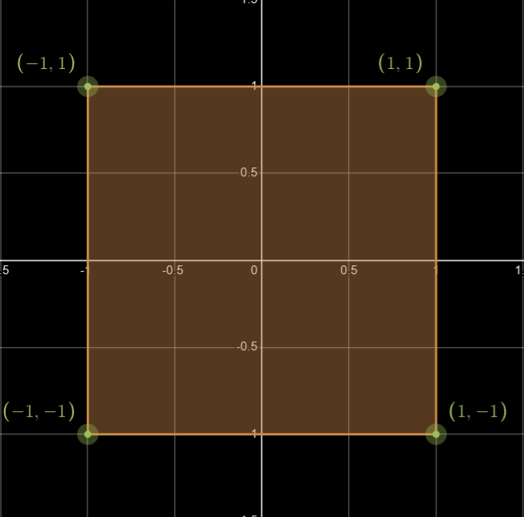
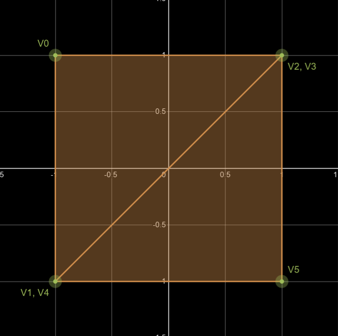

## Introduction

In this chapter we will set up a test renderer and ease into the OpenGL rendering API.
We'll set up a shader program and transfer some vertex data to the GPU. Then we're going to tell opengl
to draw them as triangles.


*You won't need to understand every opengl function call used in this chapter. It takes time to learn opengl,
so don't about getting everything straight away. Pick up a piece here and another piece there as we go. 
Cross-referencing other tutorials and guides is usually very helpful.*


## Short intro to Shaders


A shader is a program running on the GPU.
The GPU being incredibly efficient at parallel computing is capable
on running thousands of small processes at the same time.

### The Graphics Pipeline


Image Source: [LearnOpenGL](https://learnopengl.com/).

The pipeline is a series of stages converting vertex data into pixels on the display. Three of them
are programmable.

* **Vertex Shader** - shader running per. vertex (Often transforming positions from world to screen space)
* **Geometry Shader** - shader capable of adding additional geometry (optional stage)
* **Fragment Shader** - shader running color calculations for every fragment (think of them as a pixels)

Let's say the monitor has a resolution of 3840 x 2160.
```
3840 * 2160 = 8,294,400
```
That's ~8 million executions of the fragment shader.

### Shaders used in this chapter

*Shaders are written in their own language [GLSL](https://www.khronos.org/opengl/wiki/OpenGL_Shading_Language)(OpenGL Shading Language)*

In RendererTest.java we create two very simple shaders.

#### Vertex Shader

Our vertex shader takes in a position [x,y,z] and a color [r,g,b] element per. vertex (point).
the main() {} function is the shaders entry point. All we do in this simple shader is to
take the incoming color and position and pass it on to the next stage.
gl_Position is a vec4. That's because it's using homogeneous coordinate.
We'll come back to that in a later chapter when we get into matrix transformations.
Right now that value doesn't matter.

```
 #version 440
 layout (location = 0) in vec3 a_pos;
 layout (location = 1) in vec3 a_color;
 out vec3 color;
 void main() {
     color = a_color;
     gl_Position = vec4(a_pos,1.0);
 }
```
#### Fragment Shader

The fragment shader is just as simple. It takes in a color and outputs it directly to the
framebuffer.

```
#version 440
layout (location=0) out vec4 f_color;
in vec3 color;
void main() {
    f_color = vec4(color,1.0);
}
```

Let's see how we get the vertices and how we transfer them from our java program (client side) to the GPU.

## Uploading Geometry to the GPU

### (Code from RenderTest.java)

We create an array of floats representing the vertices, then we use the OpenGL
api to transfer them to the GPU.

```
[1]
float[] vertices = new float[] {
        /*{ V0 }*/-1.0f, 1.0f, 0.0f,/*position (xyz)*/0.2f, 0.1f, 0.4f,/*color (rgb)*/
        /*{ V1 }*/-1.0f,-1.0f, 0.0f,/*position (xyz)*/0.2f, 0.1f, 0.4f,/*color (rgb)*/
        /*{ V2 }*/ 1.0f, 1.0f, 0.0f,/*position (xyz)*/0.2f, 0.1f, 0.4f,/*color (rgb)*/
        /*{ V3 }*/ 1.0f, 1.0f, 0.0f,/*position (xyz)*/0.2f, 0.2f, 0.4f,/*color (rgb)*/
        /*{ V4 }*/-1.0f,-1.0f, 0.0f,/*position (xyz)*/0.2f, 0.2f, 0.4f,/*color (rgb)*/
        /*{ V5 }*/ 1.0f,-1.0f, 0.0f,/*position (xyz)*/0.2f, 0.2f, 0.4f,/*color (rgb)*/
};
[2.]
vertex_attrib_array = glGenVertexArrays();
[3.]
vertex_buffer_object = glGenBuffers();
[4.]
glBindVertexArray(vertex_attrib_array);
[5.]
glBindBuffer(GL_ARRAY_BUFFER,vertex_buffer_object);
[6.]
glBufferData(GL_ARRAY_BUFFER,vertices,GL_STATIC_DRAW);
[7.]
glVertexAttribPointer(0,3,GL_FLOAT,false,6 * Float.BYTES,0);
glVertexAttribPointer(1,3,GL_FLOAT,false,6 * Float.BYTES,3 * Float.BYTES);
glEnableVertexAttribArray(0);
glEnableVertexAttribArray(1);
glBindVertexArray(0);
```
1. We define our data. In this case, 6 vertices with position (3 float) and color (3 float).
2. We create a [vertex array object](https://www.khronos.org/opengl/wiki/vertex_Specification#Vertex_Array_Object) (VAO)
to store the format of the vertex data as well as references to the actual data buffers.
Describing the layout of the geometry. See [7.]
3. We tell opengl to generate a buffer for storing the geometry. A vertex buffer object (VBO).
It returns an integer reference for the buffer. No memory is allocated atp.
4. Then we bind the vertex array object. This tells opengl that future instructions will
affect the buffer. (until we bind another VAO or NULL)
5. For the same reason, we also bind the VBO (geometry buffer).
Note that a vertex buffer (VBO) and a vertex array object (VAO) are separate object types that take
up separate "slots" for binding. Binding the VBO does not unbind the VAO.
We bind it as a GL_ARRAY_BUFFER. The most common buffer type.
6. Here we upload the geometry (vertices array) to the currently bound GL_ARRAY_BUFFER (our VBO).
Since the geometry will stay the same for the duration of the program ("static"),
we can also give opengl a hint to let it know that this particular buffer will likely
not be modified in the future. OpenGL could use this to optimize performance.

---
**7. Now we tell opengl how we would like it to treat our data (geometry):**

One vertex consist of two elements: 3 float for position [x,y,z] and 3 float for color [r,g,b]
(It doesn't have to, but we defined it as such).
If we take a second look at our vertex shader, that's also how we specified its layout:
```
layout (location = 0) in vec3 a_position;
layout (location = 1) in vec3 a_color;
```
We need to tell opengl how the elements are stored in the buffer, and the stride between
each element. For our float vertices[] {...} array, the stride in float would be 6.
(**OpenGL operates in bytes**, but let's just stick with floats for now)

| V0 | V0 | V0 | V0 | V0 | V0 | V1 | V1 | V1 | V1 | V1 | V1 | V2 | V2 | V2 | V2 | V2 | V2 |
|----|----|----|----|----|----|----|----|----|----|----|----|----|----|----|----|----|----|
| x  | y  | z  | r  | g  | b  | x  | y  | z  | r  | g  | b  | x  | y  | z  | r  | g  | b  |
| 0  | 1  | 2  | 3  | 4  | 5  | 6  | 7  | 8  | 9  | 10 | 11 | 12 | 13 | 14 | 15 | 16 | 17 |

For each shader vertex operation, opengl needs to "increment the pointer by 6 to locate the next one".
OpenGL also need to know the internal layout of the 2 components, position and color.  

```
glVertexAttribPointer(0,3,GL_FLOAT,false,6 * Float.BYTES,0);
glEnableVertexAttribArray(0); // enable
glVertexAttribPointer(1,3,GL_FLOAT,false,6 * Float.BYTES,3 * Float.BYTES);
glEnableVertexAttribArray(1); // enable
```

* We tell opengl that our first component (position) is layout 0 in the shader
* it has 3 values [x,y,z]
* the values should be treated as floats
* the values should not be normalized (used to normalize integers from 0 to 1)
* the stride of one vertex is 6 floats
* the internal offset of the position component is 0
* the same for the color component except the layout location = 1, and the offset is 3 floats.

Finally, unbind the vertex array object.
```
glBindVertexArray(0);
```

Now the geometry is stored on the GPU and ready to be rendered

---

### NDC (Normalized Device Coordinates)

The OpenGL coordinate system ranges from -1 to 1 in all 3 axis.
For now, think of a box where the xy-plane is parallel to your screen,
and a z-axis extending into your screen with z = 1, where your fingers touch
the glass. As far as OpenGL is concerned, every visible object in located somewhere
inside that cube. Let's ignore the z-axis for now.



As far as OpenGL is concerned, the bottom-left corner of your screen is (-1,-1) and
the top-right corner is (1,1). This is also known as NDC (normalized device coordinated).

*When dealing with objects in our game it's advantageous to use positions relative to world space,
then transform them to NDC space in our shaders with a transformation matrix.
We're not doing this yet, but we will come back to transforms and cameras in later chapters.*


### The Vertices

```
float[] vertices = new float[] {

        /*{ V0 }*/-1.0f, 1.0f, 0.0f,/*position (xyz)*/0.2f, 0.1f, 0.4f,/*color (rgb)*/
        /*{ V1 }*/-1.0f,-1.0f, 0.0f,/*position (xyz)*/0.2f, 0.1f, 0.4f,/*color (rgb)*/
        /*{ V2 }*/ 1.0f, 1.0f, 0.0f,/*position (xyz)*/0.2f, 0.1f, 0.4f,/*color (rgb)*/

        /*{ V3 }*/ 1.0f, 1.0f, 0.0f,/*position (xyz)*/0.2f, 0.2f, 0.4f,/*color (rgb)*/
        /*{ V4 }*/-1.0f,-1.0f, 0.0f,/*position (xyz)*/0.2f, 0.2f, 0.4f,/*color (rgb)*/
        /*{ V5 }*/ 1.0f,-1.0f, 0.0f,/*position (xyz)*/0.2f, 0.2f, 0.4f,/*color (rgb)*/
};
```



We transferred 6 vertices to the GPU. Inside the render loop,
we instruct opengl to draw them as triangles with the following command:

```
glDrawArrays(GL_TRIANGLES,0,6);
```

OpenGL will know that every 3 (in the order of upload) vertices should be considered as a triangle.
The 2 triangles form a rectangle covering the viewport.


