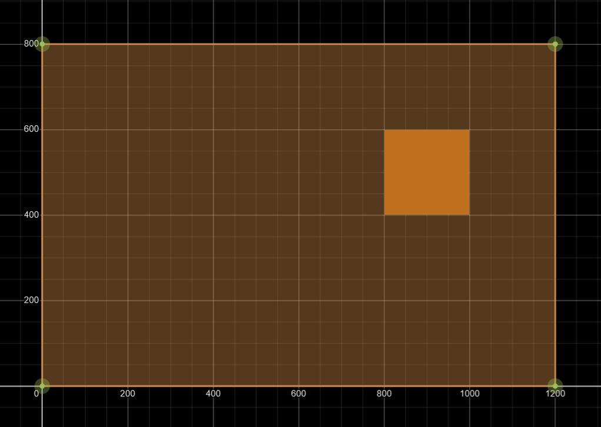

## Screen Space to OpenGL Coordinates

In the previous chapter we were drawing two triangles to the screen by uploading their
coordinates to the gpu.

```
float[] vertices = new float[] {

        /*{ V0 }*/-1.0f, 1.0f, 0.0f,/*position (xyz)*/0.2f, 0.1f, 0.4f,/*color (rgb)*/
        /*{ V1 }*/-1.0f,-1.0f, 0.0f,/*position (xyz)*/0.2f, 0.1f, 0.4f,/*color (rgb)*/
        /*{ V2 }*/ 1.0f, 1.0f, 0.0f,/*position (xyz)*/0.2f, 0.1f, 0.4f,/*color (rgb)*/
        
        /*{ V3 }*/ 1.0f, 1.0f, 0.0f,/*position (xyz)*/0.2f, 0.2f, 0.4f,/*color (rgb)*/
        /*{ V4 }*/-1.0f,-1.0f, 0.0f,/*position (xyz)*/0.2f, 0.2f, 0.4f,/*color (rgb)*/
        /*{ V5 }*/ 1.0f,-1.0f, 0.0f,/*position (xyz)*/0.2f, 0.2f, 0.4f,/*color (rgb)*/
};
```
These coordinates were in the NDC (normalized device coordinate) space. The OpenGL
coordinate system. The edges of our vertices correspond to the corners of our window.


It would be more meaningful to think in terms of screen coordinates.
(Let's say our game resolution is 1200x800)


```
/*{ V0 }*/0   , 800, 0,/*position (xyz)*/0.2f, 0.1f, 0.4f,/*color (rgb)*/
/*{ V1 }*/0   ,0   , 0,/*position (xyz)*/0.2f, 0.1f, 0.4f,/*color (rgb)*/
/*{ V2 }*/1200, 800, 0,/*position (xyz)*/0.2f, 0.1f, 0.4f,/*color (rgb)*/

/*{ V3 }*/1200, 800, 0,/*position (xyz)*/0.2f, 0.2f, 0.4f,/*color (rgb)*/
/*{ V4 }*/0   , 0  , 0,/*position (xyz)*/0.2f, 0.2f, 0.4f,/*color (rgb)*/
/*{ V5 }*/1200, 0  , 0,/*position (xyz)*/0.2f, 0.2f, 0.4f,/*color (rgb)*/
```
We need to convert from screen coordinates to normalized device coordinates.
Converting from screen space to NDC is quite easy. 
First we convert from screen space to normalized screen space by dividing the
vertex positions by the window resolution.
```
normalized_x = vertex_position_x / resolution_width;
normalized_y = vertex_position_y / resolution_heigh;
```
This will give us coordinates somewhere in normalized screen space:


Then to convert from normalized screen space to NDC space:
```
x = normalized_x * 2.0 - 1.0;
y = normalized_y * 2.0 - 1.0; 
```
Which gives us coordinates somewhere in between -1.0 and 1.0.

We can do these calculations on the gpu by modifying our vertex shader:

```
#version 440
layout (location = 0) in vec3 a_pos;        // screen space
layout (location = 1) in vec3 a_color;
const vec2 resolution = vec2(1200.0,800.0);
out vec3 color;
void main() {
    color = a_color;
    vec2 position_xy = vec2(a_pos.xy);
    position_xy /= resolution;              // normalize screen space
    position_xy = position_xy * 2.0 - 1.0;  // opengl coordinates (ndc)
    gl_Position = vec4(position_xy, a_pos.z, 1.0);
}
```
Couldn't we do the transformations on the CPU? Yes, we could. But shaders do these things
a lot faster. These are simple transformations. Later these operations get more complicated when dealing
with world space (where something is in the actual game world).
We're only drawing 2 triangles, imagine transforming millions of vertices.

## Resizing

What happens when the window resolution changes?


### Viewport


Without updating the viewport, the triangles would no longer fit the window.
This is why we make a call to opengl before start rendering:

```
glViewport(0,0,widow_width,window_height);
```


What this does, is to tell opengl what area of the window we would like to draw to.
We are updating the NDC surface area:
* ndc(-1,-1) -> screen(0,0)
* ndc( 1, 1) -> screen(window_width, window_height). 

Instead of using the entire window surface area,
we would rather like to keep the aspect ratio (1200 / 800)
and update our surface area to match:


This is why we calculate this surface area in our GLFWWindow class (viewport)
and pass these values in instead:
```
glViewport(viewport_x,viewport_y,viewport_w,viewport_h);
```
* ndc(-1,-1) -> screen(viewport_x,viewport_y)
* ndc( 1, 1) -> screen(viewport_w,viewport_h)


## Another Rectangle

Let's draw an orange rectangle to the window



Do to this we have to change a few lines in RendererTest.java.

Add 6 vertices to our vertices array:
```
/*{ V0 }*/800 , 600, 0,/*position (xyz)*/(193 / 255f), (112 / 255f), (31 / 255f),/*color (rgb)*/
/*{ V1 }*/800 , 400, 0,/*position (xyz)*/(193 / 255f), (112 / 255f), (31 / 255f),/*color (rgb)*/
/*{ V2 }*/1000, 600, 0,/*position (xyz)*/(193 / 255f), (112 / 255f), (31 / 255f),/*color (rgb)*/

/*{ V3 }*/1000, 600, 0,/*position (xyz)*/(193 / 255f), (112 / 255f), (31 / 255f),/*color (rgb)*/
/*{ V4 }*/800 , 400, 0,/*position (xyz)*/(193 / 255f), (112 / 255f), (31 / 255f),/*color (rgb)*/
/*{ V5 }*/1000, 400, 0,/*position (xyz)*/(193 / 255f), (112 / 255f), (31 / 255f),/*color (rgb)*/
```
And tell OpenGL to draw 12 vertices in the draw method (not 6):
```
public void draw() {
    glUseProgram(shader_program);
    glBindVertexArray(vertex_attrib_array);
    
    glDrawArrays(GL_TRIANGLES,0,12); // < -----
    
    glBindVertexArray(0);
    glUseProgram(0);
}
```


## IO Utility Classes

Added 2 classes to read and write from files.

* Resources.java - resource folder
* ExternalFile.java - external files


