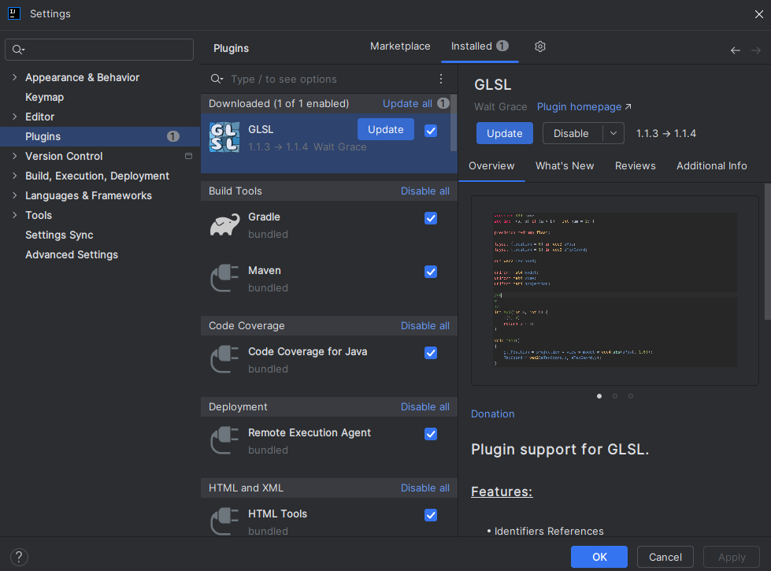
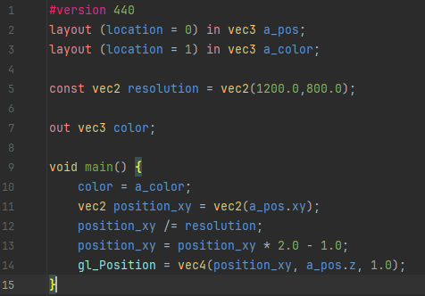

## Streamlining Shader Creation

### Previously
Setting up shaders in RenderTest.java (previous chapters) involved a lot of code.

```
// create an empty shader program
shader_program = glCreateProgram();
// create vertex shader object
int vertex_shader = glCreateShader(GL_VERTEX_SHADER);
// copy the shader source characters into the shader object
glShaderSource(vertex_shader,vertex_shader_source);
// compile the vertex shader
glCompileShader(vertex_shader);
int compile_status = glGetShaderi(vertex_shader,GL_COMPILE_STATUS);
if (compile_status == GL_FALSE) {
    String error_message = glGetShaderInfoLog(vertex_shader);
    glDeleteShader(vertex_shader);
    glDeleteProgram(shader_program);
    throw new Exception(error_message);
} // attach the vertex shader to the program
glAttachShader(shader_program,vertex_shader);

// create fragment shader object
int fragment_shader = glCreateShader(GL_FRAGMENT_SHADER);
// copy the shader source characters into the shader object
glShaderSource(fragment_shader,fragment_shader_source);
// compile the fragment shader
glCompileShader(fragment_shader);
compile_status = glGetShaderi(fragment_shader,GL_COMPILE_STATUS);
if (compile_status == GL_FALSE) {
    String error_message = glGetShaderInfoLog(fragment_shader);
    glDeleteShader(vertex_shader);
    glDeleteShader(fragment_shader);
    glDeleteProgram(shader_program);
    throw new Exception(error_message);
} // attach the fragment shader to the program
glAttachShader(shader_program,fragment_shader);

// link the program
// each attached shaders will be used to create an executable
// that will run for that stage in the graphics pipeline
glLinkProgram(shader_program);

// Once the shaders have been linked, there is no need to keep them around
glDetachShader(shader_program,vertex_shader);
glDetachShader(shader_program,fragment_shader);
glDeleteShader(vertex_shader);
glDeleteShader(fragment_shader);
int link_status = glGetProgrami(shader_program,GL_LINK_STATUS);
if (link_status == GL_FALSE) {
    String error_message = glGetProgramInfoLog(shader_program);
    glDeleteProgram(shader_program);
    throw new Exception(error_message);
}
// checks to see whether the executables contained in
// program can execute given the current OpenGL state
glValidateProgram(shader_program);
int validate_status = glGetProgrami(shader_program,GL_VALIDATE_STATUS);
if (validate_status == GL_FALSE) {
    String error_message = glGetProgramInfoLog(shader_program);
    glDeleteProgram(shader_program);
    throw new Exception(error_message);
}
```
## Shader and ShaderProgram wrapper classes

To simplify the process of setting up shaders I've med two new classes.
* **Shader.java** - code for a specific stage in the graphics pipeline
* **ShaderProgram.java** - all the stages linked together in a program


```
String vert_shader_source = Resources.asString("render-test.vert");
String frag_shader_source = Resources.asString("render-test.frag");
Shader vert_shader = new Shader(vert_shader_source, Shader.Type.VERT_SHADER);
Shader frag_shader = new Shader(frag_shader_source, Shader.Type.FRAG_SHADER);
shader_program = new ShaderProgram(vert_shader,frag_shader);
shader_program.detachShaders(true);
```
This code does pretty much the same thing as the previous block of code.
Except, now we load external shader files instead of using strings.
So we load the shader code to strings. 

Then we create the Shader objects using
the strings as argument. Creating a new Shader will upload the
string to the gpu and compile the glsl code. If the code is
not valid glsl, the Shader constructor will throw an exception with a
message telling you what went wrong. Even the line where the compilation failed.

If the Shaders compiled successfully, we can use them to create a new ShaderProgram.
Creating a new shader program will link the compiled shaders together to create
a cohesive shader program. If the linking process failed the constructor will throw
an exception telling you what went wrong.

After linking the programs together you are free to detach and delete the Shaders
from the program. (Successfully linking the program creates an executable. Once
you have the executable you no longer need to keep the source code on the gpu.)


## GLSL Plugin (Intellij)

Now that we have a way to load shader files, 
let's download the [GLSL](https://www.khronos.org/opengl/wiki/Core_Language_(GLSL)) plugin for Intellij.




It's useful to have some syntax highlighting for when we start editing shader files.



## Uniforms

[Uniforms](https://www.khronos.org/opengl/wiki/Uniform_(GLSL)) are a shader variable type. 
They're values stored in the program itself and are therefore accessible
at any stage of the program (vertex / geometry / fragment-shader). 
Uniforms do not change from one shader stage to the next.
But unlike the const variable type...

```
const vec2 resolution = vec2(1200.0,800.0);
```
...a uniform can be modified from the java side (game code). By uploading new values to the GPU.
The new uniform value will stay set to the last given value until you change it again.

```
uniform float u_time;
```
Let's modify our fragment shader with a time uniform to store the game runtime.
We're going to use it to output the RED color channel as a function of time. 

```
#version 440
layout (location=0) out vec4 f_color;
in vec3 color;
uniform float u_time;

void main() {
    float r = (sin(u_time) + 1.0) / 2.0;
    float g = color.g;
    float b = color.b;
    float a = 1.0;
    f_color = vec4(r,g,b,a);
}
```

### Java side

In our RenderTest.java draw method, after we bind the shader program.
We can upload the runtime of our game to the program easily by referencing the uniform by name:

```
ShaderProgram.useProgram(shader_program);
ShaderProgram.setUniform("u_time",runTimeSeconds());
glBindVertexArray(vertex_attrib_array);
glDrawArrays(GL_TRIANGLES,0,12);
```
*ShaderProgram.java has a lot of methods to upload uniform values for various primitives,
vectors and matrices*


## Useful Resources

* [The Book of Shaders](https://thebookofshaders.com/)
* [Shadertoy](https://www.shadertoy.com/)

