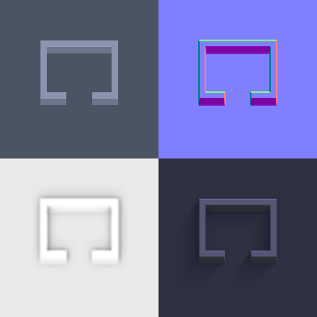
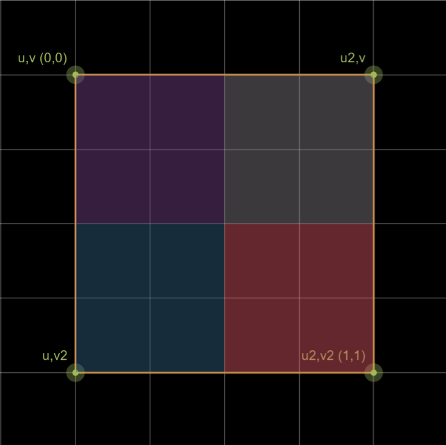
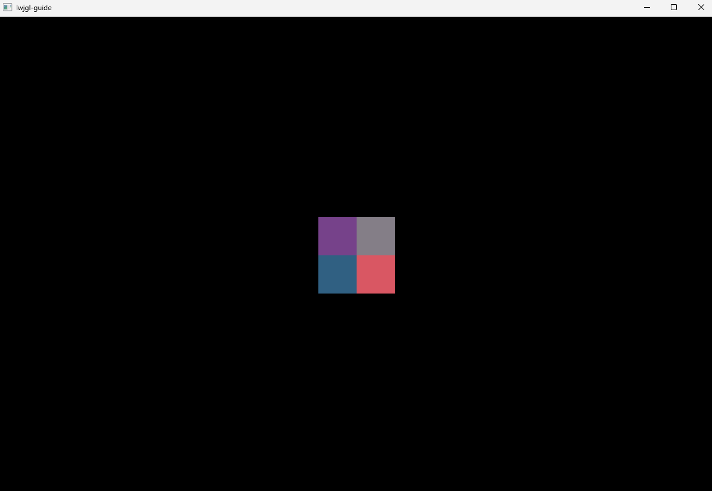

## Bitmap

A Bitmap is an array of bytes representing image color information (Pixels).
Commonly RED, GREEN, BLUE (and ALPHA) with a byte of data for each channel (32-bit color).

*Here each color-channel can have 256 different values ( 1 / 256 precision).
It's limited, but still good enough for most monitors (8-bit per channel [color depth](https://en.wikipedia.org/wiki/Color_depth)).*

Image files are usually in a compressed format (like png or jpeg),
when talking about bitmaps I am referring to the uncompressed image. The array of "pixels".

The byte array begins in the TOP-LEFT pixel of the image and ends with the BOTTOM-RIGHT pixel.
Where RED is the least significant byte. In the case for RGBA the layout would look like this:

| pixel 0 | pixel 0 | pixel 0 | pixel 0 | pixel 1 | pixel 1 | pixel 1 | pixel 1 |
|---------|---------|---------|---------|---------|---------|---------|---------|
| R       | G       | B       | A       | R       | G       | B       | A       |

Example: fetch color-value from bitmap (RGBA):

```
// The alpha value of the 5th pixel in the 7th row

int row = 7;
int col = 5;
int channels = 4; // rgba
int channel_offset = 3; // alpha channel offset

int pixel_offset = (row * image_width + col) * channels;
byte color_value = bitmap[ pixel_offset + channel_offset ];

```

Example: fetch a value from bitmap (black and white):

```
// The value of the 5th pixel in the 7th row

int row = 7;
int col = 5;
int channels = 1; // red only 
int channel_offset = 0; // just one channel

int pixel_offset = (row * image_width + col) * channels;
byte color_value = bitmap[ pixel_offset + channel_offset ];

```

### Loading images

To load images from IO, we are going to use the [stb image library](https://github.com/nothings/stb).
(LWJGL provides it for us). With it, we can load then decode png files.  

I've made the Resources and ExternalFile utility classes to load files, 
and a Bitmap class to store the decoded pixels:

```
public class Bitmap implements Disposable {
    private final ByteBuffer pixels;
    private final int width;
    private final int height;
    private final int channels;
    // ...
```

Making the process of loading images more convenient:

```
String image_path = ... ;       // path relative to the resources folder
int size = ... ;                // approximate size of the image (buffer will auto grow to fit)
boolean vFlip = false;          // if we need to flip the image vertically

ByteBuffer png = Resources.readToBuffer(image_path, size);
Bitmap bitmap = new Bitmap(png,vFlip);
```

Inside the Bitmap constructor we decode the png and store the pixels. 
The bitmap array is allocated by stb and must be freed before exiting the program.
That's why the Bitmap class implements Disposable. It's to signify that this object must be freed by us
to avoid memory leaks.

## Bitmap to Texture

Now that we can load our images and store them on the CPU in an uncompressed format,
we need to be able to upload the image data in a meaningful way to the GPU.
The image needs to be accessible on the GPU for us to sample colors from it in the shader.

### What are Textures

When I think of the word texture I think of a material. A material can be rich in colors, flat or rugged etc.
Some common use cases are color images (diffuse), normal maps, depth maps, shadow maps, light maps. Any information we need to sample
from our shaders to display onto our screen. A texture can even be 1D, 3D or an array of images.



*Even though it's helpful to think of textures in terms of images (something visual) stored on the GPU. 
In opengl a [Texture](https://www.khronos.org/opengl/wiki/texture) is something very specific
in terms of format, layout and how they should be interpreted. We're dealing with computers after all.*

For the purpose of our code, bitmaps are images on the CPU and textures are images on the GPU.

## Sampling Textures

In the previous chapter we rendered a few rectangles (two triangles making up a rectangle) with colors we specified with our vertices:

```
/*{ V0 }*/0   , 800, 0,/*position (xyz)*/0.2f, 0.1f, 0.4f,/*color (rgb)*/
/*{ V1 }*/0   ,0   , 0,/*position (xyz)*/0.2f, 0.1f, 0.4f,/*color (rgb)*/
/*{ V2 }*/1200, 800, 0,/*position (xyz)*/0.2f, 0.1f, 0.4f,/*color (rgb)*/
/*{ V3 }*/1200, 800, 0,/*position (xyz)*/0.2f, 0.2f, 0.4f,/*color (rgb)*/
/*{ V4 }*/0   , 0  , 0,/*position (xyz)*/0.2f, 0.2f, 0.4f,/*color (rgb)*/
/*{ V5 }*/1200, 0  , 0,/*position (xyz)*/0.2f, 0.2f, 0.4f,/*color (rgb)*/
```

Where each vertex had a color assigned to it. We specified all the colors to be the same, giving
our triangles an even color along it's surface.

*If we had specified different values for each vertex,
the colors would be interpolated between the vertices. And we would see a color gradient between the
points. That happens when the vertex shader passes the color values onto the fragments shader.*

```
#version 440
layout (location=0) out vec4 f_color;
in vec3 color;
uniform float u_time;

void main() {
    float r = (sin(u_time) + 1.0) / 2.0;
    float g = color.g;
    float b = color.b;
    float a = 1.0;
    f_color = vec4(r,g,b,a);
}
```
The color value passed in to the fragment shader is an interpolation between the color of the three vertices
of the triangle the fragment is inside. Where the closest vertex would have the most influence.

Now instead of passing in colors with our vertices, we'd like to use colors from an image instead.
"Covering the rectangle with our image". To achieve this, we need to know what part of the image
correspond to what vertex. We would like the bottom right vertex to be the bottom right corner of
the image and the same for the rest of the corners.



### UV Coordinates

The UV coordinate system is not in pixels, but a normalized value between 0 and 1, where the center of the texture is 0.5,0.5.
I have seen the origin (0,0) specified as the bottom left corner, which can be intuitive (cartesian coordinates).
But I put the origin in the top left corner (where the first pixel is located) shown in the figure above.
As long as you are consistent with the coordinates both ways work.

### Sampling Textures using UV Coordinates

We'll come back to how we upload textures to the gpu later on. But right now, let's look at
how we sample textures in the fragment shader.

Instead of uploading colors with our vertices, we pass along the UV coordinates.

```
/*{ V0 }*/x1, y2, 0,/*position (xyz)*/0.0f, 0.0f,/*texture coordinate (uv)*/
/*{ V1 }*/x1, y1, 0,/*position (xyz)*/0.0f, 1.0f,/*texture coordinate (uv)*/
/*{ V2 }*/x2, y2, 0,/*position (xyz)*/1.0f, 0.0f,/*texture coordinate (uv)*/
/*{ V3 }*/x2, y2, 0,/*position (xyz)*/1.0f, 0.0f,/*texture coordinate (uv)*/
/*{ V4 }*/x1, y1, 0,/*position (xyz)*/0.0f, 1.0f,/*texture coordinate (uv)*/
/*{ V5 }*/x2, y1, 0,/*position (xyz)*/1.0f, 1.0f,/*texture coordinate (uv)*/
```
Make some small changes to the vertex shader. (UV instead of color),
and pass the UV's on to the fragment shader.

```
layout (location = 0) in vec3 a_pos;
layout (location = 1) in vec2 a_uv;
const vec2 resolution = vec2(1200.0,800.0);
out vec2 uv;

void main() {
    uv = a_uv;
    vec2 position_xy = vec2(a_pos.xy);
    position_xy /= resolution;
    position_xy = position_xy * 2.0 - 1.0;
    gl_Position = vec4(position_xy, a_pos.z, 1.0);
}
```
Just like with color, the UV's get interpolated between the vertices.
And the interpolated UV is then used to sample the texture in the fragment shader.

```
layout (location=0) out vec4 f_color;
uniform sampler2D u_texture;
in vec2 uv;

void main() {
    f_color = texture(u_texture,uv);
}
```
Outputting the color at coordinate (u,v) of our texture to the framebuffer.

*The sampler2D object is used to sample from a 2D texture. We need to tell opengl
what texture is used for sampling (we'll come back to that later).* 


## Generating / Uploading Textures

Let's go though some changes in our RendererTest class.

```
[1]
// Load a png file from the resources folder
ByteBuffer png = Resources.readToBuffer("texture-test.png",512);
Bitmap bitmap = new Bitmap(png,false); // decode the png to a bitmap
[2]
texture = glGenTextures(); // generate a texture (reference used for future operations)
glActiveTexture(GL_TEXTURE0); // activate texture slot 0 (future operations apply to texture slot 0)
glBindTexture(GL_TEXTURE_2D,texture); // and bind the texture to slot 0 (texture is now the active texture)
[3]
// specify format and allocate memory on the gpu (GL_RGBA8 tells opengl that the size of a pixel is 4 * 8 = 32bit)
glTexStorage2D(GL_TEXTURE_2D,1,GL_RGBA8,bitmap.width(),bitmap.height());
// transfer the actual pixel data to gpu storage,
// telling opengl how to interpret the data (we have 4 channels rgba of type unsigned byte)
glTexSubImage2D(GL_TEXTURE_2D,0,0,0,bitmap.width(),bitmap.height(),GL_RGBA,GL_UNSIGNED_BYTE,bitmap.pixels());
// Note: You could also allocate and transfer the pixels in one operation.
[4]
// telling opengl how the texture should be sampled
glTexParameteri(GL_TEXTURE_2D,GL_TEXTURE_MIN_FILTER,GL_NEAREST);
glTexParameteri(GL_TEXTURE_2D,GL_TEXTURE_MAG_FILTER,GL_NEAREST);
glTexParameteri(GL_TEXTURE_2D,GL_TEXTURE_WRAP_S,GL_REPEAT);
glTexParameteri(GL_TEXTURE_2D,GL_TEXTURE_WRAP_T,GL_REPEAT);

// we no longer need the bitmap stored on the cpu
// we free the bitmap to avoid memory leak
bitmap.dispose();
```

1. Load and decode a png and store it as a bitmap.
2. We tell opengl to generate a texture, then we bind the texture to the active texture slot.
You can have multiple textures bound to multiple texture slots, 
and you can swap what textures are bound to which slot. 
Textures bound to these slots can be sampled from within the shaders.
3. We then tell opengl to allocate room for the texture and upload the bitmap to the gpu.
4. And tell opengl how to sample the texture.


**I recommend looking at the documentation for each of the gl-methods.
Also, to read the [Learn OpenGL](https://learnopengl.com/Getting-started/Textures) resource on Textures.
They go through some topics I won't be covering here**

After creating the shader we set the sampler uniform to use texture unit 0 for sampling.
This is the same slot we bound our texture to above.

```
ShaderProgram.setUniform("u_texture",0);
```
So from now on (until we bind another texture to slot 0 or set the u_texture uniform to another slot),
The sampler2D uniform will use this texture for sampling
```
uniform sampler2D u_texture;
```
For more detail on the GLSL sampler variable type, read the [khronos documentation](https://www.khronos.org/opengl/wiki/Sampler_(GLSL)#Texture_lookup_functions)

## Color Utility Class

I created a Color class with static methods for converting between various Color formats.

32 bit RGBA is just one of many ways to represent a color on a computer.
Depending on what you are using the color for, other color formats might be better suited. (I.e. Hue Saturation Value)
Or it might be better to do calculations in a normalized format instead of 8-bits per color.

Color is a large topic, and we will touch on some of them as we get further out in the guide. 




