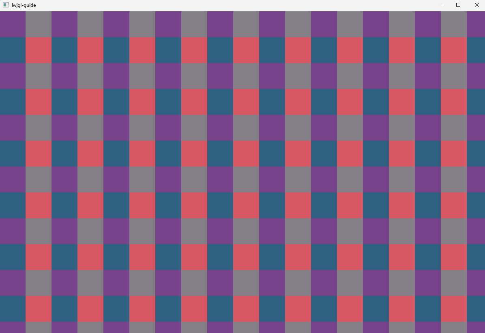

## Streamlining OpenGL Texture Calls

### Changes
What kind of Java programmers would we be if we wouldn't immediately start making **everything**
into objects. From RendererTest of the previous chapter we initialized our texture with the following code:  

```
// TEXTURE

// Load a png file from the resources folder
ByteBuffer png = Resources.readToBuffer("texture-test.png",512);
Bitmap bitmap = new Bitmap(png,false); // decode the png to a bitmap
texture = glGenTextures(); // generate a texture (reference used for future operations)
glActiveTexture(GL_TEXTURE0); // activate texture slot 0 (future operations apply to texture slot 0)
glBindTexture(GL_TEXTURE_2D,texture); // and bind the texture to slot 0 (texture is now the active texture)
// specify format and allocate memory on the gpu (GL_RGBA8 tells opengl that the size of a pixel is 4 * 8 = 32bit)
glTexStorage2D(GL_TEXTURE_2D,1,GL_RGBA8,bitmap.width(),bitmap.height());
// transfer the actual pixel data to gpu storage,
// telling opengl how to interpret the data (we have 4 channels rgba of type unsigned byte)
glTexSubImage2D(GL_TEXTURE_2D,0,0,0,bitmap.width(),bitmap.height(),GL_RGBA,GL_UNSIGNED_BYTE,bitmap.pixels());
// Note: You could also allocate and transfer the pixels in one operation.
// telling opengl how the texture should be sampled
glTexParameteri(GL_TEXTURE_2D,GL_TEXTURE_MIN_FILTER,GL_NEAREST);
glTexParameteri(GL_TEXTURE_2D,GL_TEXTURE_MAG_FILTER,GL_NEAREST);
glTexParameteri(GL_TEXTURE_2D,GL_TEXTURE_WRAP_S,GL_REPEAT);
glTexParameteri(GL_TEXTURE_2D,GL_TEXTURE_WRAP_T,GL_REPEAT);
// we no longer need the bitmap stored on the cpu
// we free the bitmap to avoid memory leak
bitmap.dispose();
```

Now, shortened to:
```
// TEXTURE

ByteBuffer png = Resources.readToBuffer("texture-test.png",512);
Bitmap bitmap = new Bitmap(png,false); // decode the png to a bitmap
texture = bitmap.asTexture(); // create texture from bitmap
texture.bindToSlot(0);  // bind to texture slot 0
texture.filterNearest(); // sample nearest pixel (as opposed to linear filtering)
texture.textureRepeat(); // UV repeats
bitmap.dispose(); // free the bitmap
```
In this chapter we'll take a closer look at textures while making utility classes
for opengl texture calls.

### OOP and Opengl (Sidenote)
I encourage you NOT to force opengl objects to fit the Java OOP paradigm.
OpenGL works like a state machine. Calls like:

```
glBindTexture(GL_TEXTURE_2D,texture);
```
will bind the opengl texture object to the active texture slot.
Future texture calls / operations will modify that textures state.
Even if you can encapsulate a texture (or other opengl objects) into a Java class, it's still **very** easy to
do operations on another object than the intended one. You might assume calling:

```
texture.alterSomething(new_value);
```
would change the opengl object you intended to encapsulate, but forgot to bind the actual opengl texture object.
So while thinking you are modifying the texture you're actually modifying another one.
Things like this can make your program prone to bugs and be... very frustrating.
So just be aware of this if you're coming from Java. I'd recommend getting comfortable using the
opengl calls directly before trying to wrap and hide opengl functionality in Java objects.   

### That said...

I made a new class to encapsulate opengl textures.

```
public class Texture implements Disposable {

    private TextureFormat format;   // texture format
    private int id;                 // opengl texture reference
    private int mip_levels;         // mipmap levels
    private final int target;       // texture target
    private final int width;        // width of texture
    private final int height;       // height of texture (1D Array / 2D)
    private final int depth;        // depth of texture (2D Array / 3D)
    private boolean allocated;      // texture has been allocated
```

#### Texture Format (Image format)

> An [Image Format](https://www.khronos.org/opengl/wiki/Image_Format) describes the way that
> the images in Textures and renderbuffers store their data. They define the meaning of the image's data.

The format is used to tell opengl what kind of image format the texture is and how it should be interpreted.
We touched upon this in the previous chapter. When we allocate, upload, copy or modify a texture, opengl
need to know how it should interpret the continuous array of bytes (texture data). 
How many color channels are there, what's the size of each component, should the values be normalized
in the shader, should they even be interpreted as colors at all? Etc.
I encourage you to read about [image formats](https://www.khronos.org/opengl/wiki/Image_Format).

The TextureFormat class (enum) is a collection of common image formats and related values.


#### Texture Target

The [Texture Target](https://www.khronos.org/opengl/wiki/texture#Theory) is one of:

>* **GL_TEXTURE_1D:** Images in this texture all are 1-dimensional. They have width, but no height or depth.
>* **GL_TEXTURE_2D:** Images in this texture all are 2-dimensional. They have width and height, but no depth.
>* **GL_TEXTURE_3D:** Images in this texture all are 3-dimensional. They have width, height, and depth.
>* **GL_TEXTURE_RECTANGLE:** The image in this texture (only one image. No mipmapping) is 2-dimensional. Texture coordinates used for these textures are not normalized.
>* **GL_TEXTURE_BUFFER:** The image in this texture (only one image. No mipmapping) is 1-dimensional. The storage for this data comes from a Buffer Object.
>* **GL_TEXTURE_CUBE_MAP:** There are exactly 6 distinct sets of 2D images, each image being of the same size and must be of a square size. These images act as 6 faces of a cube.
>* **GL_TEXTURE_1D_ARRAY:** Images in this texture all are 1-dimensional. However, it contains multiple sets of 1-dimensional images, all within one texture. The array length is part of the texture's size.
>* **GL_TEXTURE_2D_ARRAY:** Images in this texture all are 2-dimensional. However, it contains multiple sets of 2-dimensional images, all within one texture. The array length is part of the texture's size.
>* **GL_TEXTURE_CUBE_MAP_ARRAY:** Images in this texture are all cube maps. It contains multiple sets of cube maps, all within one texture. The array length * 6 (number of cube faces) is part of the texture size.
>* **GL_TEXTURE_2D_MULTISAMPLE:** The image in this texture (only one image. No mipmapping) is 2-dimensional. Each pixel in these images contains multiple samples instead of just one value.
>* **GL_TEXTURE_2D_MULTISAMPLE_ARRAY:** Combines 2D array and 2D multisample types. No mipmapping.

*We will mostly be dealing with 2D and 2D Array textures.*

When we bind the texture to a texture slot,
we bind the texture to the texture target:

```
glActiveTexture(slot);
glBindTexture(target,id);
```
This means that multiple textures can be bound to the same slot, but only
one for each target.

*Once a texture target has been set, the target cannot change for the lifetime of that texture.*

The Texture class have convenience methods for binding:

```
public void bindToSlot(int slot) { bindToSlot(slot,target, id); }
public void bindToActiveSlot() { bindToActiveSlot(target, id); }
public int bindTooAnySlot() { return bindToAny(target, id); }
```
Now atp. this might start to seem complicated. Just know that binding a texture to a slot (or texture unit) makes that texture
accessible to be sampled from in the shader.

If you want to know how glActiveTexture and glBindTexture actually works and how they relate to each other, a
question and the accepted answer on [stackoverflow](https://stackoverflow.com/questions/8866904/differences-and-relationship-between-glactivetexture-and-glbindtexture)
was very helpful to my understanding.

#### Mip maps

[Mip maps](https://www.khronos.org/opengl/wiki/texture#Mip_maps) are pre-shrunk versions of the full-sized image.
It's often helpful to sample from smaller versions of an image if the object is far from view (the camera) or the
objects surface angle to the view gets "very sharp". The sampler can then pick the most suited "mip map" and
avoid aliasing artifacts.

> When sampling a texture, the implementation will automatically select which mipmap to use 
> based on the viewing angle, size of texture, and various other factors.


### Generating Textures

To generate a texture we can call one of these factory methods.
They will generate a texture and set the texture target (final / cannot be changed)

```
public static Texture generate1D(int width);
public static Texture generate1DArray(int width, int layers);
public static Texture generate2D(int width, int height);
public static Texture generate2D(int size);
public static Texture generate2DArray(int width, int height, int layers);
public static Texture generate2DArray(int size, int layers);
public static Texture generate3D(int width, int height, int depth);
```
### Allocation

Once the texture has been generated (target is set as well as the texture dimensions),
we can allocate space for the texture on the GPU.

```
public void allocate(TextureFormat format, boolean mipmap) {
    if (hasBeenDisposed()) throw new IllegalStateException("cannot allocate storage for disposed textures");
    if (hasBeenAllocated()) throw new IllegalStateException("texture storage already allocated");
    int i_format = format.sized_format;
    this.mip_levels = mipmap ? calculateMipmapLevels() : 1;
    this.format = format;
    this.allocated = true;
    switch (target) {
        case GL_TEXTURE_1D -> glTexStorage1D(target,mip_levels,i_format,width);
        case GL_TEXTURE_2D, GL_TEXTURE_1D_ARRAY -> glTexStorage2D(target,mip_levels,i_format,width,height);
        case GL_TEXTURE_3D, GL_TEXTURE_2D_ARRAY -> glTexStorage3D(target,mip_levels,i_format,width,height,depth);
        default -> throw new IllegalStateException("Unexpected value: " + target);
    }
}
```
Passing in a TextureFormat and a boolean for whether we want to allocate space to generate mip maps.
With this final information (in addition to dimensions) we know exactly how much memory is needed to
store the texture.


### Uploading the Pixels

Now we can upload the Bitmap pixels (ByteBuffer).
How we tell opengl to interpret the data depends on the texture target and format.
You can read the documentation for [glTexSubImage2D](https://docs.gl/gl4/glTexSubImage2D) for a better understanding.


```
public void uploadSubData(ByteBuffer data) { uploadSubData(data,0); }
public void uploadSubData(ByteBuffer data, int level) { uploadSubData(data, level, width, 0); }
public void uploadSubData(ByteBuffer data, int level, int width, int x_off) { uploadSubData(data, level, width, height, x_off, 0); }
public void uploadSubData(ByteBuffer data, int level, int width, int height, int x_off, int y_off) { uploadSubData(data, level, width, height, depth, x_off, y_off,0); }
public void uploadSubData(ByteBuffer data, int level, int width, int height, int depth, int x_off, int y_off, int z_off) {
    if (hasBeenDisposed()) throw new IllegalStateException("cannot transfer data to disposed textures");
    if (!hasBeenAllocated()) throw new IllegalStateException("texture storage not allocated");
    glPixelStorei(GL_UNPACK_ALIGNMENT,format.pack_alignment);
    int transfer_format = format.pixel_format;
    int data_type = format.pixel_data_type;
    switch (target) {
        case GL_TEXTURE_1D -> glTexSubImage1D(target,level,x_off,width,transfer_format,data_type,data);
        case GL_TEXTURE_2D, GL_TEXTURE_1D_ARRAY -> glTexSubImage2D(target,level,x_off,y_off,width,height,transfer_format,data_type,data);
        case GL_TEXTURE_3D, GL_TEXTURE_2D_ARRAY -> glTexSubImage3D(target,level,x_off,y_off,z_off,width,height,depth,transfer_format,data_type,data);
        default -> throw new IllegalStateException("Unexpected value: " + target);
    }
}
```

## Texture Filtering / Wrap


```
// VERTICES

Resolution app_res = Engine.get().window().gameResolution();
final float x1 = 0.0f;
final float y1 = 0.0f;
final float x2 = app_res.width();
final float y2 = app_res.height();
final float u1 = 0.0f;
final float v1 = 0.0f;
final float u2 = (float) app_res.width() / tex.width();     // U2 > 1.0f (repeats)
final float v2 = (float) app_res.height() / tex.height();   // V2 > 1.0f (repeats)
final float[] vertices = new float[] {

        /*{ V0 }*/x1, y2, 0,/*position (xyz)*/u1, v1,/*texture coordinate (uv)*/
        /*{ V1 }*/x1, y1, 0,/*position (xyz)*/u1, v2,/*texture coordinate (uv)*/
        /*{ V2 }*/x2, y2, 0,/*position (xyz)*/u2, v1,/*texture coordinate (uv)*/
        /*{ V3 }*/x2, y2, 0,/*position (xyz)*/u2, v1,/*texture coordinate (uv)*/
        /*{ V4 }*/x1, y1, 0,/*position (xyz)*/u1, v2,/*texture coordinate (uv)*/
        /*{ V5 }*/x2, y1, 0,/*position (xyz)*/u2, v2,/*texture coordinate (uv)*/

};
```



