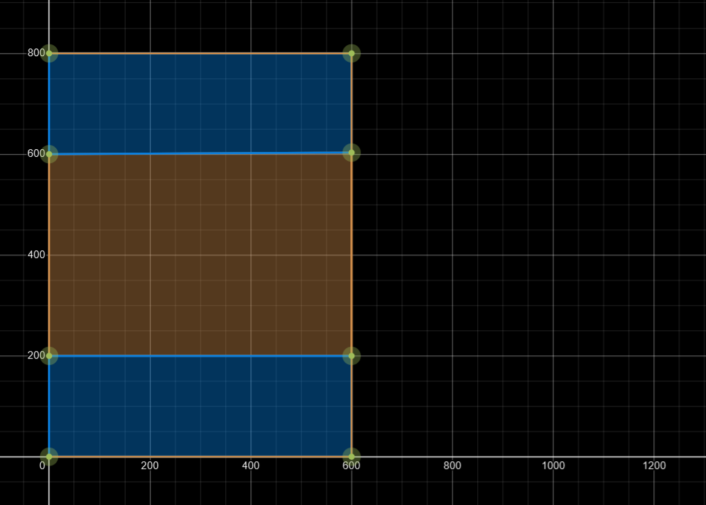

## Input Processing

The core game-loop can be broken down into:

* One **outer loop** that runs at a target "frames per second".
* And an **inner loop** that runs at a target "updates per second".

If the target FPS > target UPS then the outer loop could run several
times without entering the inner loop.

And if the target FPS < target UPS, the inner loop might run several
times for each outer loop.


```
fixed_time_step = 1/30; // update game 30 times / second

// runs at monitors refresh rate (with v-sync enabled)
// one loop = one frame
while(running) { 

    // time of the last frame
    time_accumulator += time.frameTimeSeconds();
    
    // update at fixed timestep
    // one loop = one update tick
    while (time_accumulator >= fixed_time_step) {
    
        // game logic
        // Here you might want to check if any buttons were pressed etc.
        // I.e. LEFT_PRESSED -> Move left
        game.update(); 
        
        time_accumulator -= fixed_time_step;
    }
    
    // triggers input event callbacks
    // if any since the previous frame
    window.pollUserEvents();
    
    game.render();
    
    // v-sync happens here (if enabled)
    // waits to sync up with the monitor refresh rate.
    // display the framebuffer content
    window.swapRenderBuffers();

}
```

You can see that in every frame we are polling for [user events](https://www.glfw.org/docs/3.3/input_guide.html#events).
Key presses, cursor movements etc. And if there were any events, glfw will trigger appropriate callbacks.
We have set up callback listeners in the GLFWWindow class. One example:

```
glfwSetCursorPosCallback(window, new GLFWCursorPosCallback() {
    public void invoke(long window, double xpos, double ypos) {
        mouse.onCursorHover(xpos,ypos);
    }
});
```

### Queueing Input

When game update ticks and input polling happens at different time intervals, we have to be careful
not to "miss input". 

Let's say the game updates at 30 ups and the outer / render loop runs at 144 fps.
The pollUserEvents() picks up that the user has pressed the LEFT_ARROW_KEY.
But once the next update tick happens (could be 4 frames later) the user has already released
the arrow key and the game logic could miss the button press entirely.

We also need to be careful the other way around (UPS > FPS). In that case typing a character
might be interpreted as the user holding that character down or other similar bugs.

To solve these problems, callbacks called when polling user events are queued for processing.

```
void keyEventCallback(int key) {
    queue.push(key);
}
```
or
```
void mouseScrollEventCallback(float amount) {
    scroll_amount += amount;
}
```
Then during the update tick we process the inputs queued from the callbacks.

```
void processInput() {
    while(!queue.isEmpty()) 
        process(queue.pop());
}
```
Main loop

```
fixed_time_step = 1/30; // update game 30 times / second

// runs at monitors refresh rate (with v-sync enabled)
// one loop = one frame
while(running) { 

    // time of the last frame
    time_accumulator += time.frameTimeSeconds();
    
    // input should be processed
    boolean process_input = true;
    
    // update at fixed timestep
    // one loop = one update tick
    while (time_accumulator >= fixed_time_step) {
    
        // We also take care not to process input
        // more than once each frame.
        if (process_input) {
            // process the input queues
            processInput();
            process_input = false;
        }
    
        // game logic
        // Here you wan't to check if any buttons were pressed etc.
        // I.e. LEFT_PRESSED -> Move left
        game.update(); 
        
        time_accumulator -= fixed_time_step;
    }
    
    // triggers input event callbacks
    // if any since the previous frame
    // queues up input to be processed
    window.pollUserEvents();
    
    game.render();
    
    // v-sync happens here (if enabled)
    // waits to sync up with the monitor refresh rate.
    // display the framebuffer content
    window.swapRenderBuffers();

}
```

## Keyboard

The Keyboard class has callbacks for key and character press events.
The callback events are queued for processing. 

[Keys](https://www.glfw.org/docs/3.3/input_guide.html#input_key) are both printable and non-printable characters.
GLFW has a [predefined set of tokens](https://www.glfw.org/docs/3.3/group__keys.html).
We make sure the key is contained in the set. "mod" can be an additional modifier key like "control" or "shift".
"action" is one of GLFW_PRESS, GLFW_REPEAT or GLFW_RELEASE.

```
protected void onKeyEvent(int key, int mods, int action) {
    if (key != GLFW_KEY_UNKNOWN && key < GLFW_KEY_LAST) {
        key = action != GLFW_RELEASE ? key : -key;
        if (queued_keys.size() == 48) {
            queued_keys.dequeue();
            queued_keys.dequeue();
            queued_keys.dequeue();
        }
        queued_keys.enqueue(key);
        queued_keys.enqueue(mods);
        queued_keys.enqueue(action);
    }
}
```

[Characters](https://www.glfw.org/docs/3.3/input_guide.html#input_char) from glfw callback are unicode-code-points.
In our case we are only using the first 127 characters (ascii range).

```
protected void onCharPress(int codepoint) {
    switch (codepoint) {
        // remapping norwegian letters
        case 230: codepoint = 101; break; // æ -> e
        case 248: codepoint = 111; break; // ø -> o
        case 229: codepoint = 97 ; break; // å -> a
    }   // filtering out characters outside ascii range
    if ((codepoint & 0x7F) == codepoint) {
        if (queued_chars.size() == 16) {
            queued_chars.dequeue();
        } queued_chars.enqueue(codepoint);
    }
}
```

We keep track of the currently pressed and previously pressed keys.

```
private final boolean[] c_keys = new boolean[GLFW_KEY_LAST]; // currently pressed
private final boolean[] p_keys = new boolean[GLFW_KEY_LAST]; // previously pressed
```
Before we process the input queues we copy the current array to the previous key array.
Then we update the current array with any keys stored from the callbacks.

```
if (key_event) {
    System.arraycopy(c_keys,0,
    p_keys,0, GLFW_KEY_LAST);
    key_event = false;
}

while (!queued_keys.isEmpty()) {
    int key = queued_keys.dequeue();
    if (key > 0) {
        c_keys[key] = true;
    } else {
        key = Math.abs(key);
        c_keys[key] = false;
    }
}
```

We keep track of the previous state so we can query whether a key was just pressed or released.
For example:

```
public boolean justPressed(int key) {
    return c_keys[key] && !p_keys[key];
}

public boolean justReleased(int key) {
    return p_keys[key] && !c_keys[key];
}
```

## Mouse

The Mouse class has callbacks for mouse and cursor events.

For button press events we keep track of the LEFT, RIGHT and MIDDLE (wheel) buttons.
And like keyboard keys, we track the previous state for each button to query for whether
a button was just pressed.

There is also the concept of dragging. Dragging happens if one or more buttons are held
down for a set duration of time and the cursor has moved.
*(The duration is just an arbitrary value that feels ok. Right now it's ~(6/60) seconds.)*
While dragging, the origin and a drag vector are stored and can be queried.


### Coordinates

GLFW gives us cursor coordinates relative to the top-left corner of the windows content area
(excluding the top bar of windowed-mode windows).

We convert the cursor screen coordinates to a normalized viewport format.
If you remember from chapter 4, the viewport dynamically fit to the window, keeping
a target aspect ratio even if the window resizes.

*Viewport keeping a 3:2 aspect ratio (brown) inside a resized window (blue)*


Normalized viewport coordinates have the origin (0,0) in the bottom-left corner of the viewport.
And (1,1) in the top-right corner of the viewport.
The normalized format can easily be converted to other coordinate systems.
I.e. multiply with the target resolution to get the coordinates as if
the viewport had that resolution. Or multiply with 2 and subtract 1 to get
normalized device coordinates (-1 to 1).

```
private void screenToViewportCoordinates(Vector2d cursor) {
    GLFWWindow window = Engine.get().window();
    window.windowScreenSize(window_size);
    // Inverting y to bottom instead of top.
    cursor.y = window_size.y - cursor.y;
    // Framebuffer width and height should equal the size
    // of the windows content area as far as I know.
    // But just in case they ar not, I'm attempting to adjust.
    cursor.x *= ((double) window.framebufferW() / window_size.x);
    cursor.y *= ((double) window.framebufferH() / window_size.y);
    // Adjusting to window viewport and normalizing to [0-1] range.
    cursor.x = (cursor.x - window.viewportX()) / window.viewportW();
    cursor.y = (cursor.y - window.viewportY()) / window.viewportH();
}
```

## Changes to RendererTest

To test the Mouse class we draw the rectangle at the center of the cursor.
Previously we only updated our vertex buffer once. When uploading the vertices during initialization.
Now we want to re-upload the vertices each frame.

So instead of uploading the vertices array, we allocate an empty buffer with enough memory
to store the 2 triangles (6 vertices * 5 float). And instead of GL_STATIC_DRAW we use
GL_DYNAMIC_DRAW, telling opengl that the content could change frequently.

```
 // VERTICES

vertex_attrib_array = glGenVertexArrays();
vertex_buffer_object = glGenBuffers();
glBindVertexArray(vertex_attrib_array);
glBindBuffer(GL_ARRAY_BUFFER,vertex_buffer_object);

// size of buffer = 6 vertices * 5 floats * 4 bytes
glBufferData(GL_ARRAY_BUFFER,(long) 6 * 5 * Float.BYTES,GL_DYNAMIC_DRAW);

// previously:
// glBufferData(GL_ARRAY_BUFFER,vertices,GL_STATIC_DRAW);

glVertexAttribPointer(0,3,GL_FLOAT,false,5 * Float.BYTES,0);
glVertexAttribPointer(1,2,GL_FLOAT,false,5 * Float.BYTES,3 * Float.BYTES);
glEnableVertexAttribArray(0);
glEnableVertexAttribArray(1);
glBindVertexArray(0);
```
Draw method
```
public void draw(Vector2d cursor) {
    
    // try with resources
    try (MemoryStack stack = MemoryStack.stackPush()){
        // build the triangles (rectangle with center at cursor)
        Resolution app_res = Engine.get().window().gameResolution();
        float cx = (float) cursor.x() * app_res.width();
        float cy = (float) cursor.y() * app_res.height();
        float x1 = cx - 32;
        float x2 = cx + 32;
        float y1 = cy - 32;
        float y2 = cy + 32;
        float u1 = 0.0f;
        float v1 = 0.0f;
        float u2 = 1.0f;
        float v2 = 1.0f;
        // Allocate native stack memory
        FloatBuffer vertices = stack.mallocFloat(6 * 5);
        vertices.put(x1).put(y2).put(0).put(u1).put(v1);
        vertices.put(x1).put(y1).put(0).put(u1).put(v2);
        vertices.put(x2).put(y2).put(0).put(u2).put(v1);
        vertices.put(x2).put(y2).put(0).put(u2).put(v1);
        vertices.put(x1).put(y1).put(0).put(u1).put(v2);
        vertices.put(x2).put(y1).put(0).put(u2).put(v2);
        // Bind the buffer and upload the vertices
        glBindBuffer(GL_ARRAY_BUFFER,vertex_buffer_object);
        glBufferSubData(GL_ARRAY_BUFFER,0,vertices.flip());
    }
    ShaderProgram.useProgram(shader_program);
    glBindVertexArray(vertex_attrib_array);
    glDrawArrays(GL_TRIANGLES,0,6);
    glBindVertexArray(0);
}
```
