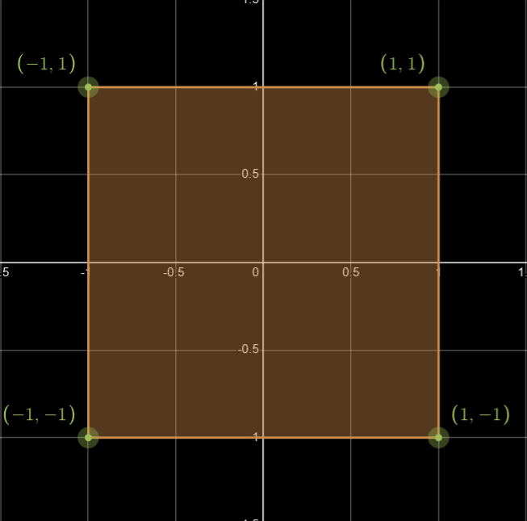
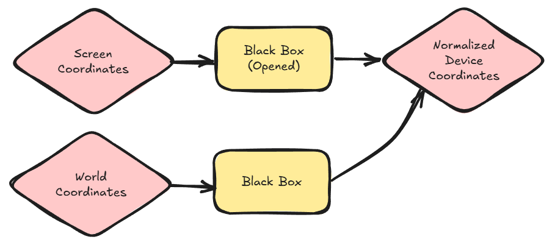
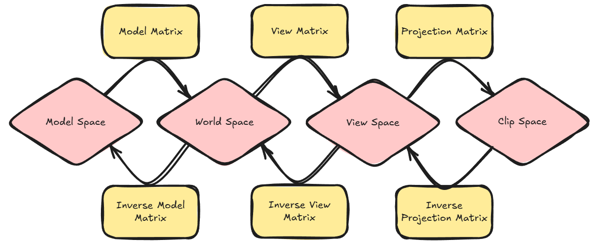
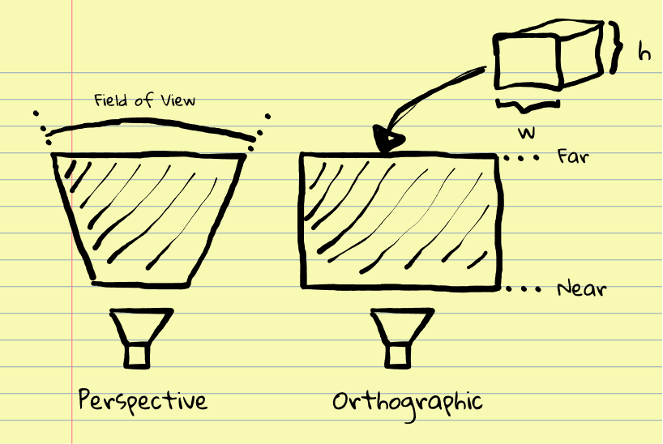
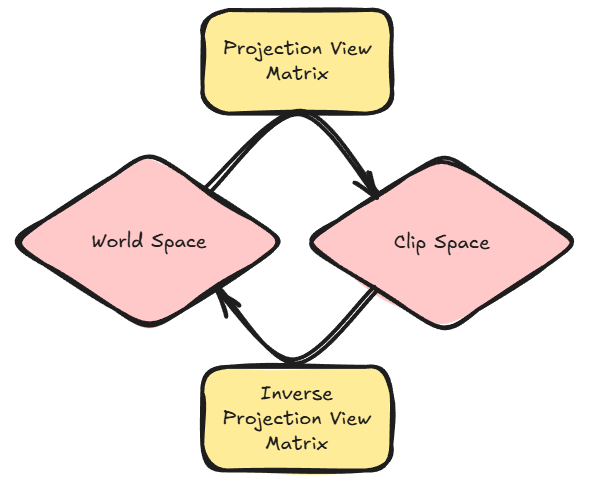
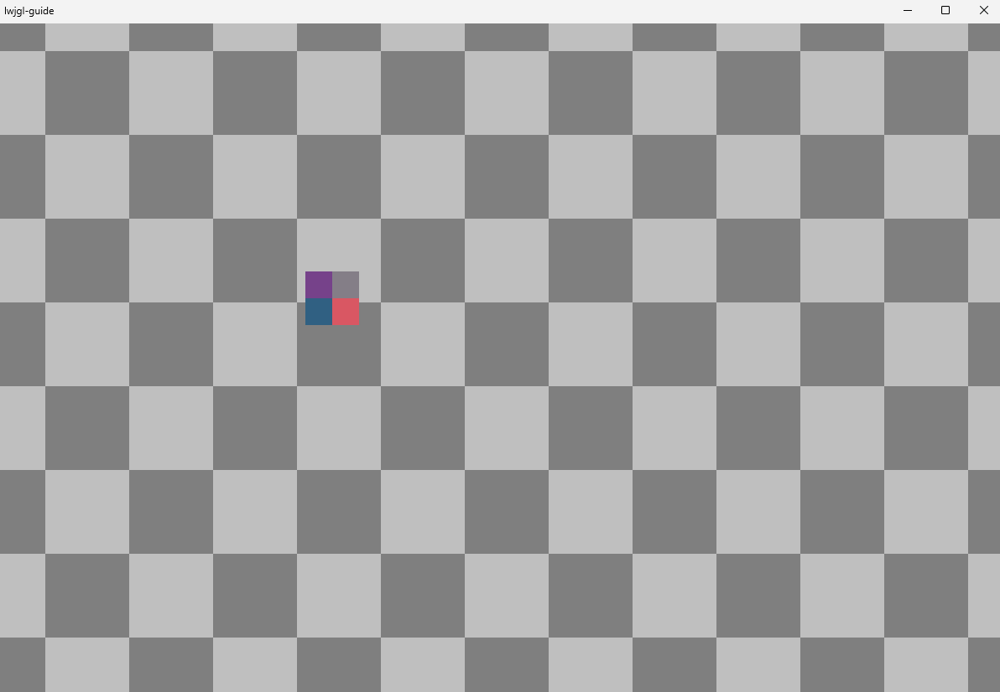

## Camera


Up until now we have drawn triangles using screen coordinates for the vertices' positions.
And in the vertex shader we convert from screen space to the opengl coordinate system (normalized device coordinates).
If you recall from a previous chapter, the opengl coordinate system looks like this:


(excluding the z-axis where the positive direction is pointing towards you (right-handed))

So, to convert the vertex positions from screen coordinates to the [-1,1] range, 
we have done the following in the vertex shader:

```
normalized_position = vertex_screen_position /= resolution;      // [0,1] range
normalized_device_coordinates = normalized_position * 2.0 - 1.0; // [-1,1] range
gl_Position = vec4(normalized_device_coordinates, 0.0, 1.0);     // (z = 0.0) 
```

### World Coordinates

Simply using screen coordinates to draw could work for rendering UI. But
if you want to place objects somewhere in your world and draw the objects relative
to some perspective we need to rely on matrix transformations.



### One Space to Another

I'm not going through how the various transformations work here. There are already many great resources that
explains it better than I could. (I will include links to some of them at the bottom of the chapter)

It's not necessary to understand how the various matrix transformations work to use them.
You just need to know what they do in terms of input and output.

#### Coordinate spaces common in 3D graphics




#### Model space

When importing 3D models, the models' vertices are usually relative to some center point (0,0) on the model, 
neatly oriented on the axis and unscaled.

#### World Space

The models' coordinates in the game world.
The model matrix (or model to world matrix) is a composite of 3 transforms.
Scale, translation and rotation. And is used to place the object in the world.

#### View Space

The models' world coordinates relative to the camera.
The view matrix is used to transform world space coordinates to camera space.

#### Clip Space

The models' coordinates in the OpenGL coordinate system [-1,1].
Triangles outside this range will get "clipped". (Not rendered)
The projection matrix is used to transform view space coordinates to clip space.

**Orthographic and Perspective projection**



In addition to the view matrix, the camera has a projection matrix.
The perspective view is typical for 3D scenes. Objects further from the camera eye,
appears smaller on the screen than nearby objects. Objects from an orthographic perspective
will appear to be the same size no matter the distance to the camera.

### Top Down Camera for 2D

We will be working with 2D scenes and our cameras will always be perpendicular
to the XY-Plane, never rotating or moving in the Z-direction.
(We might render Sprites at different predefined Z-layers if we need to later)
So we will be creating an orthographic camera.

#### Another thing about coordinate transformation

If we're not using 3D models, there's no need for model matrices.
We'll be rendering sprites in world space coordinates.
The View and Projection matrices can also be combined into one matrix
transformation.



We will be uploading this projection-view matrix to our vertex shader
each frame and use this to transform our world coordinates directly
to OpenGL coordinates like this:

```
gl_Position = proj_view * vec4(world_position, 0.0, 1.0); 
```

## The Camera2D Class

```
public class Camera2D {

    private static final Vector3f UP = new Vector3f(0,1,0); // y-axis is always up (relative to dir)

    public final Matrix4f view = new Matrix4f();        // view matrix
    public final Matrix4f projection = new Matrix4f();  // projection matrix
    public final Matrix4f combined = new Matrix4f();    // view projection matrix (combined)
    public final Matrix4f combined_inv = new Matrix4f();// inverse combined matrix

    public final Rectanglef bounds = new Rectanglef();      // visible world area
    public final Vector3f position  = new Vector3f(0,0,1);  // camera position (eye)
    public final Vector3f direction = new Vector3f(0,0,-1); // camera facing
    public final Vector2f viewport  = new Vector2f(16,9);   // size of visible area in world units (zoom == 1)

    public float far  = 257.0f; // far plane / distance from eye (anything beyond gets clipped)
    public float near = 1.00f;  // near plane / distance from eye (anything closer gets clipped)
    public float zoom = 1.0f;   // zoom (used to expand, contract the frustum making the scene appear smaller / larger)

    public void refresh() {
        direction.set(position.x,position.y,-1);
        view.identity().lookAt(position,direction,UP);
        float lr = viewport.x / 2f * zoom;
        float tb = viewport.y / 2f * zoom;
        projection.identity().ortho(-lr,lr,-tb,tb,near,far);
        bounds.setMax(position.x + lr, position.y + tb);
        bounds.setMin(position.x - lr, position.y - tb);
        combined.set(projection).mul(view);
        combined_inv.set(combined).invert();
    }

    /** set camera xy position */
    public void setPosition(Vector2f position) {
        this.position.set(position.x,position.y,this.position.z);
    }

    /** translate camera in xy */
    public void translate(Vector2f translation) {
        position.add(translation.x,translation.y,0);
    }
    
    /**
     * convert vector from normalized viewport space to a world vector
     * @param vector vector to convert
     */
    public void unProjectVector(Vector2f vector) {
        vector.mul(viewport).mul(zoom);
    }

    /**
     * convert position from normalized viewport space to a world position
     * @param position position to convert
     */
    public void unProjectPosition(Vector2f position) {
        // convert to normalized device coordinates
        Vector3f v3 = U.popSetVec3(
                position.x * 2 - 1,
                position.y * 2 - 1, 0);
        v3.mulProject(combined_inv);
        position.set(v3.x,v3.y);
        U.pushVec3();
    }
}
```

I should explain a few things.

#### Near and Far

Like the viewport defines the XY of our view, Near and far
defines the range of the view relative to the camera direction.
Objects rendered to close or to far away from the camara eye will
we clipped.

These are somewhat arbitrary (at least for our purposes),
but near should be > 0.0 and the (near - far) should be a reasonable value (in world units).
One reason for this is that when the world coordinates is projected into clip space,
everything between near and far will get "squished" into the [-1,1] range.
We have not discussed the depth buffer yet, but let's just say that between -1 and 1 there
typically is 8 to 32bit of values for depth. And the further near is from far, the closer z values
for objects in your scene get "squished" together. This can lead to "z-fighting" where objects
close together appear to flicker in front and back of each other from one frame to the next.

But this is more common in 3D scenes. For now, we have [depth testing](https://learnopengl.com/Advanced-OpenGL/Depth-testing)
disabled. Which means we're not really using depth, every object we draw gets rendered over
existing objects. We render our scenes back to front.

#### The "viewport" instance variable:

```
// size of visible area in world units (zoom == 1)
public final Vector2f viewport  = new Vector2f(16,9);
```
The viewport defines our view in world units. 
The default values 16 and 9 simply defines our viewport to be 16 units wide
and 9 units high. So if we render a rectangle with width = 1 and height = 1,
it would cover 1x1 units of the 16x9 units screen. 
If we set the viewport size to the screen resolution, then 1x1 unit would be the
size of a pixel.

#### Camera Bounds

A nice thing about 2D orthographic perspective, is that it's very easy to
figure out the viewing area. It's simply a rectangle, and we can use it
to check if objects are inside or outside the view. If they are, we don't
need to render them.

#### Zoom

When were zooming we're actually just scaling the camera viewport.
```
viewport *= zoom;
```
Which makes it appear as if the camera is being translated along the z-axis.
But it's only the width and height of our view expanding and contracting.
 
#### Screen Space to World Space

With the combined projection view matrix we can transform world coordinates to
screen space. But we can also go in the opposite direction, transforming screen space
coordinates to world space.

The "unProject" methods can convert the cursor position to world space.
Making it possible to select entities and objects in our world.

*Our Mouse class does not use screen coordinates per se. But something
I call normalized viewport coordinates [0,1]. To get screen coordinates from
normalized viewport, simply multiply with the current game resolution.*

## Camera Controls

Last chapter we implemented a Mouse and a Keyboard that we're going to use to control
our camera.

### Mouse

* Scroll Wheel - zoom in/out
* Scroll Wheel - press to drag

### Keys

* WASD or Arrow Keys - move around

### Code

```
private boolean camera_currently_zooming = false;
private float camera_zoom_timer = 0.0f;
private float camera_zoom_accumulator;
private float camera_current_zoom;
private float camera_target_zoom;
private final Vector2f camera_drag_origin = new Vector2f();

private void cameraControl(Camera2D camera, float delta_time) {

    final float move_speed = 5.0f;
    final float zoom_speed = 1.5f;
    final float zoom_min = -2.0f;
    final float zoom_max = 4.0f;

    GLFWWindow window = Engine.get().window();
    Keyboard keys = window.keys();
    Mouse mouse = window.mouse();
    Vector2f velocity = U.popVec2().zero();
    if (keys.pressed(GLFW_KEY_W) || keys.pressed(GLFW_KEY_UP)) velocity.y += 1;
    if (keys.pressed(GLFW_KEY_A) || keys.pressed(GLFW_KEY_LEFT)) velocity.x -= 1;
    if (keys.pressed(GLFW_KEY_S) || keys.pressed(GLFW_KEY_DOWN)) velocity.y -= 1;
    if (keys.pressed(GLFW_KEY_D) || keys.pressed(GLFW_KEY_RIGHT)) velocity.x += 1;
    if (velocity.x != 0 || velocity.y != 0) {
        velocity.normalize().mul(move_speed * delta_time);
        camera.translate(velocity);
    } U.pushVec2();

    if (mouse.scrolled()) {
        float scroll_value = mouse.scrollValue();
        if (camera_currently_zooming) {
            if (scroll_value > 0.0) { // scroll in
                if ((camera_current_zoom > camera_target_zoom) && camera_zoom_timer < 0.3) {
                    camera_target_zoom -= scroll_value;
                    camera_target_zoom = Math.max(camera_target_zoom,zoom_min);
                } else camera_zoom_accumulator -= scroll_value;
            } else { // scroll out
                if ((camera_current_zoom < camera_target_zoom) && camera_zoom_timer < 0.3) {
                    camera_target_zoom -= scroll_value;
                    camera_target_zoom = Math.min(camera_target_zoom,zoom_max);
                } else camera_zoom_accumulator -= scroll_value;
            }
        } else {
            camera_target_zoom = camera_current_zoom - scroll_value;
            camera_target_zoom = U.clamp(camera_target_zoom,zoom_min,zoom_max);
            if (camera_current_zoom != camera_target_zoom) {
                camera_currently_zooming = true;
                camera_zoom_timer = 0.0f;
            }
        }
    }

    if (camera_currently_zooming) {
        camera_zoom_timer += delta_time * zoom_speed;
        if (camera_zoom_timer >= 1.0f) {
            camera_current_zoom = camera_target_zoom;
            camera.zoom = U.pow(2, camera_current_zoom);
            if (camera_zoom_accumulator != 0.0) {
                camera_target_zoom = camera_current_zoom + camera_zoom_accumulator;
                camera_target_zoom = U.clamp(camera_target_zoom,zoom_min,zoom_max);
                camera_zoom_accumulator = 0.0f;
            } else camera_currently_zooming = false;
            camera_zoom_timer = 0.0f;
        } else {
            float t = U.smooth(camera_zoom_timer);
            float zoom = U.lerp(camera_current_zoom, camera_target_zoom,t);
            camera.zoom = U.pow(2,zoom);
            System.out.println(camera.zoom);
        }
    }

    if (mouse.isDragging(Mouse.WHEEL)) {
        if (mouse.justStartedDrag(Mouse.WHEEL)) {
            camera_drag_origin.set(camera.position);
        } Vector2f drag = U.popSetVec2((mouse.dragVector(Mouse.WHEEL)));
        camera.unProjectVector(drag);
        camera.setPosition(camera_drag_origin);
        camera.translate(drag.negate());
        U.pushVec2();
    }
}
```

## Other Changes

### JOML Primitives

In our build.gradle.kts I have imported another small library.
It has some utility classes for primitive shapes and collision detection.

### Primitive Stacks

In the utility class U.java, I initialize stack pools of smaller math objects so we don't need
to initialize new Objects all over the place. This is just a personal preference, I doubt it affects
performance in any meaningful way. It might have a decade ago.

```
Vector2f vec1 = U.popVec2(2,4)
Vector2f vec2 = U.popVec2(0,3)
...
...
U.pushVec2(2);
```

### Checkered Background for our Scene

To notice camera movement I made a shader that draws an infinite tiled background
in our world. Each tile is 1x1 in world units.

We render a rectangle in NDC [-1,1], covering our screen. 
And in the vertex shader use the cameras inverse-projection-view matrix
to convert the rectangle corners into world space, 
and pass the world coordinates to the fragment shader.

*(gl_Position is not given position in world coordinates, but in NDC. The world coordinates
are only used in the fragment shader)*

```
layout (location = 0) in vec2 a_pos; // ndc
uniform mat4 u_combined_inv;
out vec2 world_pos;
void main() {
    // convert normalized device coordinates to world coordinates
    // and pass it on to the fragment shader
    world_pos = (u_combined_inv * vec4(a_pos,0.0,1.0)).xy;
    gl_Position = vec4(a_pos,0.0,1.0);
}
```
In the fragment shader we use the world position of the fragment
to determine the fragments color. 

```
layout (location=0) out vec4 f_color;
in vec2 world_pos;
void main() {
    vec3 rgb;
    // checkered pattern
    float val = mod(floor(world_pos.x) + mod(floor(world_pos.y), 2.0), 2.0);
    if(val == 0) {
        rgb = vec3(0.75);
    }  else rgb = vec3(0.5);
    f_color = vec4(rgb,1.0);
}
```



## Resources

[Learning OpenGL - Coordinate Systems](https://learnopengl.com/Getting-started/Coordinate-Systems)

[Projection Matrices - Theory](https://www.songho.ca/opengl/gl_projectionmatrix.html)

[Explaining Model View Projection](https://www.youtube.com/watch?v=-tonZsbHty8) (YouTube)

[](https://www.youtube.com/watch?v=-tonZsbHty8 "click to watch")

